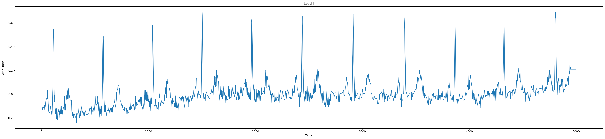
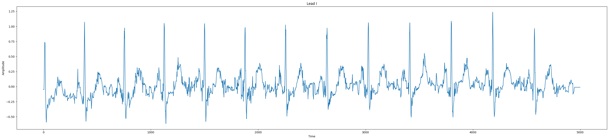

# ECG Feature Extraction and Model Evaluation

## Overview

Using 12-lead ECG data, we built CNN-based feature extractors such as 1D CNN, 2D CNN, and Residual 1D CNN with 32, 64, and 128-dimensional outputs.

## Model Comparison Summary

### Residual 1D CNN

| Model (Feature Size) | Accuracy | Loss   | Precision | Recall | AUC    | Val Accuracy | Val Loss | Val Precision | Val Recall | Val AUC |
| -------------------- | -------- | ------ | --------- | ------ | ------ | ------------ | -------- | ------------- | ---------- | ------- |
| **32 Features**      | 0.8508   | 0.3490 | 0.8530    | 0.7562 | 0.9156 | 0.8630       | 0.3180   | 0.9065        | 0.7320     | 0.9362  |
| **64 Features**      | 0.8498   | 0.3464 | 0.8554    | 0.7502 | 0.9159 | 0.8643       | 0.3253   | 0.8761        | 0.7685     | 0.9308  |
| **128 Features**     | 0.8789   | 0.2985 | 0.8836    | 0.8018 | 0.9432 | 0.8749       | 0.3085   | 0.8825        | 0.7917     | 0.9400  |

## Signal Examples

### Raw ECG Signal (Normal)

---

### Preprocessed ECG Signal

---
